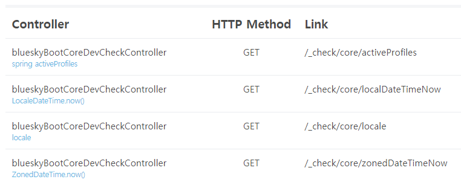
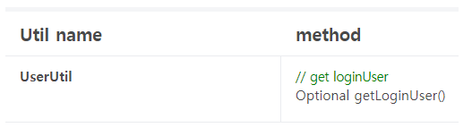

# bluesky-boot-autoconfigure-devcheck

<!-- 
bluesky-boot-autoconfigure-devcheck는 Spring Boot 기반 프로젝트에서 개발 내용 확인을 위해 만드는 개발자 확인용 controller method 목록과 일반적으로 사용되는 utility static method 목록을 확인 할 수 있도록 도와주는 라이브러리입니다.

개발 확인용 controller method 목록은 '/_check' 에서 확인할 수 있고 utility static method 목록은 '/_check/util' 에서 확인할 수 있습니다.

Thymeleaf를 사용하는 경우 Thymeleaf UI 기반으로 목록이 제공되며 그 외의 경우 JSON으로 목록을 제공합니다.
-->

bluesky-boot-autoconfigure-devcheck is a library that helps you to check the list of controller methods and commonly used utility static methods for developer checking that are made to check the development contents in Spring Boot-based projects.

You can check the list of controller methods for development check at '/_check' and the list of utility static methods at '/_check/util'.

If you are using Thymeleaf, the list is provided based on the Thymeleaf UI, otherwise as JSON.

**Prerequisites**

| devCheck | [Java](https://openjdk.java.net/^) | [Spring Boot](https://spring.io/^) |
| ------------- | ------------- | ------------- |
| 1.0.1 | 11 | 2.5.4 |
| 2.0.0 | 17 | 2.7.1 | 

## settings

### maven dependencies

```pom.xml
<dependencies>
    <dependency>
        <groupId>io.github.luversof</groupId>
        <artifactId>bluesky-boot-autoconfigure-devcheck</artifactId>
        <version>1.0.2-SNAPSHOT</version>
    </dependency>
</dependencies>
```

### properties

<!--
이 라이브러리는 dependency에 추가하면 기본 활성화되어 있습니다.

비개발 환경에서 이 라이브러리의 기능을 비활성화하고 싶은 경우 다음과 같이 설정합니다.
-->

This library is enabled by default when you add it to your dependency.

If you want to disable the functionality of this library in a non-development environment, set it as follows.

```properties
bluesky-boot.dev-check.enabled=false
```

<!--
지정된 범위에서 utility static method를 검색합니다.

다음과 같이 검사할 패키지를 지정합니다.
-->
Searches for utility static methods in the specified scope.

Specifies the packages to scan as follows:

```properties
bluesky-boot.dev-check.base-packages=net.luversof
```

<!--
devCheck의 기본 주소를 변경하고 싶은 경우 다음과 같이 설정합니다.

기본 값은 `/_check` 입니다.
-->

To change the default address of devCheck, set it like this:

The default is `/_check` .

```properties
bluesky-boot.dev-check.path-prefix=/info/_check
```

<--
path pattern으로 설정할 수도 있습니다.
-->

You can also set it as a path pattern.

```properties
bluesky-boot.dev-check.path-prefix=/{somePath}/_check
```


## usage

### DevCheckDescription annotation

<!-- 
'/_check' page에서 해당 method에 대한 설명을 나타내기 위해 DevCheckDescription annotation을 사용합니다.

controller method와 utility static method에 사용할 수 있습니다.
-->
DevCheckDescription annotation is used to indicate the description of the method in the '/_check' page.

Can be used for controller methods and utility static methods.

| attribute  | description |
| ------------- | ------------- |
| value  | <!-- method 아래 추가되는 설명 --> Description added under method  |
| displayable  | <!-- 목록 노출 여부 --> Whether the list is exposed  |

### controller method

<!-- 
controller bean이 다음 조건을 만족하는 '/_check' page 목록화 대상입니다.

* `@DevCheckController` annotation을 선언
* produce 속성은 `application/json` 
* path는 `${bluesky-boot.dev-check.path-prefix}` 로 시작하도록 설정

다음과 같이 controller를 생성합니다.
-->
 
The controller bean is a '/_check' page listing target that satisfies the following conditions.

* Declare `@DevCheckController` annotation
* The produce attribute is `application/json`
* Set path to start with `${bluesky-boot.dev-check.path-prefix}`

Create a controller like this:

```java
@DevCheckController
@RestController
@RequestMapping(value = "${bluesky-boot.dev-check.path-prefix}/core",  produces = MediaType.APPLICATION_JSON_VALUE)
public class DevCheckCoreController {

	private ApplicationContext applicationContext;

	public DevCheckCoreController(ApplicationContext applicationContext) {
		this.applicationContext = applicationContext;
	}

	@DevCheckDescription("spring activeProfiles")
	@GetMapping("/activeProfiles")
	public String[] activeProfiles() {
		return applicationContext.getEnvironment().getActiveProfiles();
	}
	
	// create GetMapping method you want to check
}
```

<!-- 
아래와 같이 해당 controller의 getMapping method가 '/_check' 목록에 추가됩니다.
-->

The getMapping method of the controller is added to the '/_check' list as shown below.




### utility static method

<!--
'/_check/util' 목록에 추가할 utility class에 @DevCheckUtil 또는 @ReactiveDevCheckUtil annotation을 선언합니다.

다음과 같이 사용합니다.
-->

Declare @DevCheckUtil or @ReactiveDevCheckUtil annotation in the utility class to be added to the '/_check/util' list.

Use it like this:

```java
@DevCheckUtil
public class UserUtil extends RequestAttributeUtil {
	
	@Setter(onMethod_ = @DevCheckDescription(displayable = false))
	private static LoginUserService loginUserService;
	
	private static final String LOGIN_USER = "__loginUser";

	@DevCheckDescription("get loginUser")
	public static Optional<User> getLoginUser() {
		Optional<User> userOptional = getRequestAttribute(LOGIN_USER);
		if (userOptional != null) {
			return userOptional;
		}
		
		userOptional = loginUserService.getUser();
		setRequestAttribute(LOGIN_USER, userOptional);
		
		return userOptional;
	}
}

```

<!--
아래와 같이 해당 utility static method가 '/_check/util' 목록에 추가됩니다.
-->

The utility static method is added to the '/_check/util' list as shown below.



## version history

| version | prerequisites |
| ------------- | ------------- |
| 1.0.1 | Java 11,
Spring Boot 2.5.4,
Thymleaf 3.0.12.RELEASE (optional)  |
| 1.0.2 | Java 11,
Spring Boot 2.6.1,
Thymleaf 3.0.12.RELEASE (optional)  |